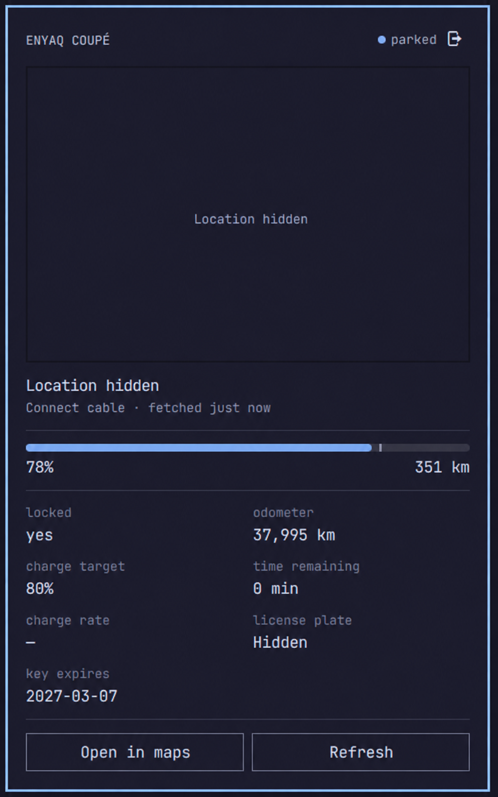

# MySkoda for Omarchy

A read-only Omarchy bar widget for vehicles available through the official
[MyŠkoda Public API](https://public.api.connect.skoda-auto.cz/docs). The bar
shows a car icon and highlights it while charging. Click it for the last known
location, address, battery or fuel level, remaining range, charging status,
lock state, odometer, license plate, and any open doors, windows, boot, or
bonnet.



Preview edited to hide location and license plate.

The helper talks directly to the supported public API. It uses an API key
created in the MyŠkoda app and does not imitate the mobile app login flow. Its
runtime dependencies are `curl`, `jq`, `awk`, and `python3`, alongside Bash
and standard system utilities.

## Install

Requires Omarchy with the Quattro shell and plugin support, plus a MyŠkoda
Public API key for a supported vehicle.

```sh
omarchy plugin add https://github.com/ricardojrgpimentel/omarchy-myskoda.git --enable
```

The widget defaults to the right side of the bar. Click the car icon to open
the vehicle panel. Move the widget through the bar settings or with:

```sh
omarchy bar move community.myskoda --section right
```

Installation does not require root access or a custom installer. Account
configuration is stored separately from the plugin files.

### Test the interface without an account

Install the included synthetic Enyaq reading, then open the widget from the
bar:

```sh
mkdir -p ~/.config/omarchy-myskoda
cp tests/fixture.json ~/.config/omarchy-myskoda/fixture.json
```

The fixture prevents all vehicle API requests. Remove it before testing your
real car:

```sh
rm ~/.config/omarchy-myskoda/fixture.json
```

### Connect your MyŠkoda account

1. Open the widget and choose **Open official API key setup**.
2. Follow the official instructions or scan their QR code with the phone that
   has the MyŠkoda app.
3. Create an API key and select the vehicle it may access.
4. Paste the vehicle's 17-character VIN and the API key into the widget.
5. Choose **Save and connect**.

The public API does not provide a garage/list-vehicles endpoint, so the VIN is
required even though the key is already bound to selected vehicles.

The terminal flow is also available:

```sh
~/.config/omarchy/plugins/community.myskoda/bin/myskoda connect YOUR_VIN
```

Confirm that the live vehicle snapshot works:

```sh
helper=~/.config/omarchy/plugins/community.myskoda/bin/myskoda
"$helper" car | jq
```

The VIN entered while connecting is the default. The optional VIN in the bar
widget settings overrides it, which is useful when one key covers more than
one vehicle.

### Upgrading from version 0.1

The old access and refresh tokens cannot be converted into a public API key.
Create a new key in the MyŠkoda app and connect again. The obsolete files are
ignored and are removed the next time you sign out through the widget.

### Remove or retry

Remove the installed plugin without deleting its credentials:

```sh
omarchy plugin remove community.myskoda
```

Remove the local MyŠkoda key, VIN, cache, and any legacy credentials as well:

```sh
rm -rf ~/.config/omarchy-myskoda
rm -rf ~/.cache/omarchy-myskoda
```

## Authentication details

Every vehicle request sends the key in the `X-API-Key` header to
`https://public.api.connect.skoda-auto.cz`. The widget passes a newly entered
key to the helper over standard input, so it is not exposed in the process
argument list.

The API returns the key expiry in `X-API-Key-Expires-At`. When a key expires or
does not cover the configured VIN, create or update it in the MyŠkoda app and
paste it into the widget again.

Set both `MYSKODA_API_KEY` and `MYSKODA_VIN` to keep credentials in an external
secret manager instead of the plugin's local files.

## Security, privacy, and limits

The API key is stored with mode `0600` under
`~/.config/omarchy-myskoda/`. It is never returned to QML, printed in JSON, or
passed to `curl` as a command-line argument.

The map uses cached OpenStreetMap tiles without a map API key. Dark mode
is applied locally to the same tiles. It reveals the viewed map area
to that tile provider, but not the car identity. The street address comes from
MyŠkoda itself; the plugin does not send coordinates to a geocoder.

Downloads are bounded while reading from curl, including responses without
`Content-Length`: vehicle JSON is limited to 1 MiB, HTTP headers to 64 KiB,
and each map tile to 512 KiB. Rejected downloads are discarded before writing
response files or invoking `jq` or the image renderer. JSON must be a valid
object; map images must be valid, noninterlaced 256×256 PNGs with bounded
pixel data. Optional PNG metadata is stripped before caching and rendering.
Custom tile providers must serve this PNG format.

The tile cache is capped at 32 MiB and 2,048 files. Least recently used tiles
are removed to make room, with cache updates locked across concurrent
processes. Existing cached tiles are validated before reuse. Failed vehicle
refreshes continue to use the last valid cached reading when available.

The integration performs GET requests only. It contains no wake, lock/unlock,
climate, horn, or charging controls. Unsupported vehicle data is tolerated so
EV, hybrid, and combustion vehicles can show the data they provide.

The official API currently documents a limit of 20 requests per hour per VIN,
with the response headers being authoritative. The widget uses one vehicle
request per refresh, polls every 10 minutes by default, and keeps the last good
reading during temporary failures or rate limiting.

Sign out locally with:

```sh
~/.config/omarchy/plugins/community.myskoda/bin/myskoda logout
```

## Development

Clone the repository and run the offline checks before installing a local copy:

```sh
git clone https://github.com/ricardojrgpimentel/omarchy-myskoda.git
cd omarchy-myskoda
tests/test.sh
omarchy plugin validate .
qmllint -I /usr/share/omarchy/shell Panel.qml MapView.qml
omarchy plugin add "$PWD" --enable
```

The offline checks cover electric, hybrid, and combustion API fixtures,
credential permissions, expired keys, rate limiting, and local sign-out.
Local HTTP tests also cover oversized and malformed responses, chunked and
EOF-delimited downloads, PNG validation, and concurrent cache eviction.
They do not contact a real vehicle. Live behavior depends on the vehicle and
the data exposed by its MyŠkoda Public API key.

## Status

This is an early, unofficial integration and is not affiliated with or endorsed
by Škoda Auto.

## Credits

The Omarchy widget structure and cached slippy-map approach were inspired by
[`jankeesvw/omarchy-tesla`](https://github.com/jankeesvw/omarchy-tesla).

## License

MIT
